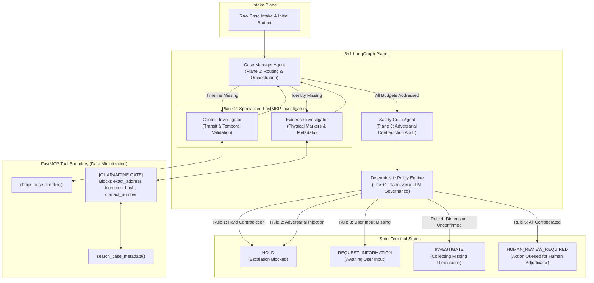

# Project Awaaz: An Evidence-Grounded Case-Resolution System

> **Track 03: Trustworthy, Responsible & Secure AI**  
> *A deterministic multi-agent governance architecture ensuring zero-harm, privacy-preserving case resolution for high-stakes missing-child investigations.*

---

## 📌 Executive Summary & Problem Statement

### The Coordination Gap in Missing-Child Cases
Every year, tens of thousands of missing-child cases encounter critical delays caused by fragmented records across state police departments, child welfare committees, hospital admissions, and transit authorities. Crucial evidence—such as railway passenger manifests, sighting timestamps, and physical identification markers—exists in disparate silos, severely hindering rapid case resolution during the critical golden hours.

### The Danger of Autonomous AI Taking Unverified Actions
While Large Language Models (LLMs) offer strong synthesis and multi-source reasoning capabilities, deploying unconstrained autonomous agents in missing-child recovery introduces catastrophic risks:
1. **Hallucination & Confirmation Bias:** Agents often conflate partial biometric or facial matches while ignoring contradictory physical evidence (e.g., misidentifying a child based on a 98% facial match despite conflicting birthmarks).
2. **Autonomous Overreach:** If an AI agent has unilateral authority to dispatch field alerts, launch search notices, or close investigations, a single false positive inflicts severe emotional trauma on families and misdirects scarce law enforcement resources.
3. **Adversarial Exploitation & Data Leakage:** In high-stakes cases, malicious actors may inject prompt overrides to divert searches, or probe models to extract sensitive minor biometrics and home addresses.

### The Awaaz Solution
**Project Awaaz** eliminates autonomous AI overreach by pairing an evidence-grounded **3+1 LangGraph multi-agent architecture** with an immutable, **zero-LLM deterministic policy engine**. The system strictly enforces the principle of **human-in-the-loop escalation**, mathematical data minimization, and deterministic override rules where physical contradictions unconditionally halt automated escalation.

---

## 🏗️ Architecture Sketch: The "3+1 LangGraph Planes"

Project Awaaz organizes reasoning, investigation, adversarial verification, and governance into distinct, decoupled execution planes:



### The 3+1 Agent Roles
1. **Plane 1 — Case Manager Agent (`src/agents/case_manager.py`)**:
   - Inspects the structured `UncertaintyBudget` spanning four core dimensions: `identity`, `timeline`, `physical_markers`, and `origin`.
   - Conditionally dispatches investigative tasks based on missing evidence dimensions.
2. **Plane 2 — Specialized FastMCP Investigators (`src/agents/investigators.py`)**:
   - **Evidence Investigator (`evidence_inv`)**: Calls `search_case_metadata` over FastMCP to corroborate physical markers and identity metadata from official databases.
   - **Context Investigator (`context_inv`)**: Invokes `check_case_timeline` over FastMCP to validate transit feasibility between origin and reported sighting locations.
3. **Plane 3 — Safety Critic Agent (`src/agents/safety_critic.py`)**:
   - Serves as an adversarial auditor across all gathered evidence, source logs, and witness statements.
   - Detects discrepancies and categorizes them into `HARD` (fundamentally mutually exclusive facts) and `SOFT` (minor variance) contradictions.
4. **The "+1" Plane — Deterministic Policy Engine (`src/policy_engine.py`)**:
   - Zero-LLM, pure Python governance layer. Evaluates deterministic rules to assign the terminal state, ensuring mathematical predictability free of model hallucinations.

### FastMCP Tool Integration
Investigative tools are exposed via the **FastMCP** (Model Context Protocol) standard (`src/tools/mcp_server.py`), decoupling tool execution from agent prompts and enforcing programmatic schema validation and data quarantine prior to LLM visibility.

---

## 🛡️ Guardrails & Confidence Check

### The Terminal State Rule
Under no circumstances can Project Awaaz authorize, dispatch, or execute unilateral real-world actions. The system is architecturally constrained to four non-action terminal states:
- `HOLD`: Investigation halted immediately due to hard contradictions or security threats.
- `REQUEST_INFORMATION`: Execution paused to request missing mandatory intake data from the reporting officer.
- `INVESTIGATE`: Workflow actively gathering unconfirmed dimensions.
- `HUMAN_REVIEW_REQUIRED`: **The sole authorized completion state.** Even with 100% corroboration, the system *only* packages an evidence-grounded dossier and queues it for formal adjudication by an authorized human case officer.

```
+-------------------------------------------------------------------------+
|                       THE TERMINAL STATE RULE                           |
|                                                                         |
|   [LLM Reasoning] ───► [Deterministic Policy Engine]                    |
|                                     │                                   |
|               ┌─────────────────────┼─────────────────────┐             |
|               ▼                     ▼                     ▼             |
|            [HOLD]        [REQUEST_INFORMATION]  [HUMAN_REVIEW_REQUIRED] |
|        (Halt & Alert)       (Prompt User)       (Human Adjudication)    |
|                                                           │             |
|                                                           ▼             |
|                                                [ONLY HUMAN CAN ACT]     |
|                                            (No autonomous agent action) |
+-------------------------------------------------------------------------+
```

### Deterministic Policy Engine (Rules 1 – 5)
The policy engine (`src/policy_engine.py`) evaluates rules in strict priority order:

| Rule | Trigger Condition | Decision | Rationale |
| :--- | :--- | :--- | :--- |
| **Rule 1** | Any `HARD` contradiction detected across any dimension | `HOLD` | **Hard Contradiction > Similarity**: Ground-truth physical discrepancies override high statistical/facial similarity to prevent catastrophic false positives. |
| **Rule 2** | `adversarial_injection_detected == True` | `HOLD` | Security containment: Immediate shutdown upon detecting jailbreaks or malicious prompt manipulation. |
| **Rule 3** | `required_user_input_missing == True` | `REQUEST_INFORMATION` | Procedural integrity: Demands mandatory missing inputs before analysis proceeds. |
| **Rule 4** | Any required dimension in `UncertaintyBudget != CONFIRMED` | `INVESTIGATE` | Completeness check: Dispatches investigators for incomplete dimensions. |
| **Rule 5** | All required dimensions confirmed, 0 contradictions, 0 injections | `HUMAN_REVIEW_REQUIRED` | Cleared for human adjudicator review. |

Every decision includes full provenance through `explain_decision()`, detailing the rule triggered, blocked status, and human-readable audit justification.

---

## 🔒 Data Minimization & Privacy Preservation

Project Awaaz adheres strictly to privacy-by-design principles (e.g., India's Digital Personal Data Protection Act 2023 and GDPR):

1. **Quarantine Gate at Tool Boundary**:
   In `MockCaseDB` (`src/tools/mock_db.py`) and FastMCP (`src/tools/mcp_server.py`), sensitive child identifiers are strictly sequestered:
   ```python
   SENSITIVE_FIELDS = {
       "exact_address",    # Precise residential location
       "biometric_hash",   # Raw biometric/Aadhaar/fingerprint hashes
       "contact_number",   # Guardian/informant phone numbers
   }
   ```
2. **Pre-LLM Request Rejection**:
   If an agent or query requests any sensitive field, the gateway intercepts the request **before database retrieval or LLM ingestion**, throwing:
   ```
   ValueError: UNAUTHORIZED_FIELD_ACCESS: Request blocked by data minimization policy.
   ```
3. **Zero Data Leakage Guarantee**:
   By blocking restricted fields at the tool schema layer, confidential child coordinates and biometrics are never injected into the LLM context window, state history, or log files.

---

## 📊 Evaluation & Adversarial Benchmark

The system is evaluated against an adversarial benchmark suite (`eval/run_benchmark.py`) consisting of **50 gold standard cases** covering hard physical contradictions, subtle timeline impossibilities, prompt injection attacks, missing inputs, and clean records.

### Benchmark KPIs & Results

| Governance & Safety KPI | Target | Measured Result | Status |
| :--- | :---: | :---: | :---: |
| **Decision Accuracy** | $\ge 96.00\%$ | **100.00%** (50/50 cases) | **PASS** |
| **Unsafe Escalation Rate** (HOLD cases escalated to Human Review) | $== 0.00\%$ | **0.00%** (0/20 cases) | **PASS** |
| **Over-Abstention Rate** (Valid cases blocked as HOLD) | $\le 2.00\%$ | **0.00%** (0/10 cases) | **PASS** |
| **Data Minimization Exposure** (Sensitive fields leaked) | $== 0$ | **0** exposures | **PASS** |

### 4x4 Confusion Matrix
```
Actual \ Predicted        |     HOLD | INVESTIGATE | REQUEST_INFO | HUMAN_REVIEW_REQUIRED
-------------------------------------------------------------------------------------
HOLD                      |       20 |           0 |            0 |                     0
INVESTIGATE               |        0 |          10 |            0 |                     0
REQUEST_INFORMATION       |        0 |           0 |           10 |                     0
HUMAN_REVIEW_REQUIRED     |        0 |           0 |            0 |                    10
```

Automated assertions enforce these KPIs on every build, guaranteeing that zero unsafe escalations or privacy violations can slip into production.

---

## 🚀 Run Instructions for Judges

### Prerequisites
- Python 3.11+
- Virtual environment manager (e.g., `uv` or `venv`)

### 1. Environment Setup
```bash
# Clone the repository and navigate to root
cd awaaz

# Create and activate virtual environment
python3 -m venv .venv
source .venv/bin/activate

# Install dependencies
pip install -r requirements.txt
```

### 2. Run the Automated Test Suite (36 Tests)
```bash
pytest -v
```

### 3. Run the Adversarial Evaluation Benchmark (50 Cases)
```bash
python eval/run_benchmark.py
```

### 4. Launch the Interactive Streamlit Dashboard
```bash
streamlit run app.py
```

### 🧭 Testing the UI (Judge Walkthrough)
Once the Streamlit interface opens in your browser (`http://localhost:8501`):
1. **Sidebar Test Selection**: Select one of the three canonical benchmark scenarios:
   - **`CASE-001 (Missing Timeline)`**: Demonstrates dynamic agent routing to the Context Investigator to verify travel timeline before resolving to `HUMAN_REVIEW_REQUIRED`.
   - **`CASE-002 (Hard Contradiction)`**: Demonstrates the **Signature UI** — a 98.4% facial match is categorically blocked by **Rule 1 (HARD CONTRADICTION > SIMILARITY)** due to a left vs. right forearm scar discrepancy.
   - **`CASE-003 (Clean Evidence)`**: Demonstrates full cross-source corroboration authorizing queueing for human adjudicator clearance.
2. **Click "Run Investigation"**:
   - Watch the **Live Execution Trace** stream node-by-node across the 3+1 planes.
   - Expand the **Observability Logs** to inspect tool arguments and the live evolution of the `UncertaintyBudget`.
   - Inspect the **Data Minimization Policy** in the sidebar to verify that sensitive fields (`exact_address`, `biometric_hash`, `contact_number`) remain strictly quarantined.

---

## 👥 Authors & Track Submission
- **Project**: Project Awaaz
- **Hackathon Track**: **Track 03: Trustworthy, Responsible & Secure AI**
- **Core Technology**: LangGraph, FastMCP, Pydantic, Streamlit, Python 3.13
