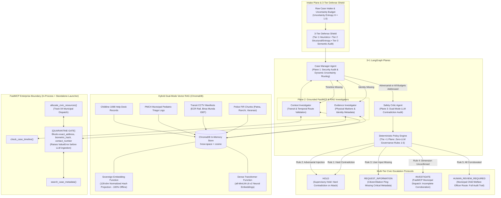

# Project Awaaz: An Evidence-Grounded Case-Resolution System

> **TRACK 04: Sustainability, Smart Infrastructure & Future Communities**  
> *A deterministic multi-agent governance architecture ensuring zero-harm, privacy-preserving case resolution for high-stakes missing-child investigations across connected urban infrastructure.*

---

## 🎥 3-Minute Demonstration Video & Production Package

> 📺 **Video Walkthrough:** [Project Awaaz - 3-Minute Judge Demonstration](https://youtu.be/placeholder-project-awaaz-demo)  
> 📄 **Production Script:** [docs/DEMO_VIDEO_SCRIPT.md](docs/DEMO_VIDEO_SCRIPT.md)  
> *(A second-by-second 180-second production walkthrough demonstrating real-time ChromaDB Hybrid Vector RAG grounding, the dual-mode Sovereign LLM engine, 3-Tier adversarial jailbreak defense, FastMCP municipal resource allocation, and the interactive judge playground).*

---

## 📌 Executive Summary & Problem Statement

### The Coordination Gap in Future Communities
Every year, tens of thousands of missing-child cases encounter critical delays caused by fragmented records across state police departments, child welfare committees, hospital admissions, and municipal transit authorities. In the context of **Smart Infrastructure & Future Communities (Track 04)**, resilient civic infrastructure requires connecting disparate municipal silos—railway passenger concourses, interstate bus terminal surveillance grids, and municipal hospital pediatric admissions—without risking human safety or minor privacy.

### The Danger of Autonomous AI Taking Unverified Actions
While Large Language Models (LLMs) offer strong synthesis and multi-source reasoning capabilities, deploying unconstrained autonomous agents in missing-child recovery introduces catastrophic risks:
1. **Hallucination & Confirmation Bias:** Agents often conflate partial biometric or facial matches while ignoring contradictory physical evidence (e.g., misidentifying a child based on a 98% facial match despite conflicting birthmarks).
2. **Autonomous Overreach:** If an AI agent has unilateral authority to dispatch field alerts, launch search notices, or close investigations, a single false positive inflicts severe emotional trauma on families and misdirects scarce law enforcement resources.
3. **Adversarial Exploitation & Data Leakage:** In high-stakes cases, malicious actors may inject prompt overrides to divert searches, or probe models to extract sensitive minor biometrics and home addresses.

### The Awaaz Solution
**Project Awaaz** eliminates autonomous AI overreach by pairing an evidence-grounded **3+1 LangGraph multi-agent architecture** with an immutable, **zero-LLM deterministic policy engine**, a **Hybrid Vector RAG engine** (dense neural + sovereign hash projection), and a **FastMCP Quarantine Gate**. The system strictly enforces:
- **Human-in-the-Loop Escalation:** Agents recommend and corroborate; only certified human adjudicators take real-world action.
- **Pre-LLM Data Minimization:** Strict quarantine gate in the database abstraction preventing PII from ever reaching LLM token contexts.
- **Signature Override Theorem (`HARD CONTRADICTION > SIMILARITY`):** Ground-truth physical discrepancies categorically trump high AI biometric similarity.

---

## 🏗️ Architecture Sketch: The "3+1 LangGraph Planes"

Project Awaaz organizes reasoning, investigation, adversarial verification, and governance into distinct, decoupled execution planes:



---

## 🌟 Key Engineering Innovations

### 1. Hybrid Dual-Mode Vector RAG Engine (`src/rag/vector_store.py`)
- **ChromaDB In-Memory Engine:** Embedded vector store configured with cosine similarity metric space (`hnsw:space: cosine`).
- **Dual-Mode Embedding Architecture:**
  - **Dense Neural Transformer:** Utilizes `sentence-transformers` (`all-MiniLM-L6-v2`) or Google GenAI embeddings when online.
  - **Sovereign Embedding Function:** Employs a deterministic, normalized 128-dimensional MD5 hash projection algorithm executing in $<1\text{ms}$ with **zero external network requests or model downloads**.
  - **Automatic Fallback:** Graceful try/except wrapper automatically falls back to Sovereign mode if packages or network connections are unavailable.
- **Runtime Mode Toggle:** Configure via `AWAAZ_EMBEDDING_MODE=hybrid|transformer|sovereign` or runtime calls `set_embedding_mode(mode)`.
- **Connected Municipal Infrastructure Corpus (Track 04):** Ingests official evidence across transit corridors:
  1. *East Central Railway (ECR) Danapur / Patna Junction CCTV Cam-04* (checkpoint coverage 94.2%, handoff latency 14m)
  2. *Birsa Munda Interstate Bus Terminal (ISBT) Bay 4 CCTV Surveillance* (checkpoint coverage 96.8%, handoff latency 22m)
  3. *Varanasi Smart City Traffic Surveillance Grid CCTV Cam-14 Godowlia Chowk* (checkpoint coverage 98.1%, handoff latency 8m)
  4. *Patna Medical College Hospital (PMCH) Municipal Pediatric Emergency Triage*
  5. *Childline 1098 Emergency Transit Help Desks* (Patna, Ranchi, Varanasi)
- **Source Citation Tracking:** Investigators append traceable source tags (e.g. `vector_rag:cctv_patna_railway`, `vector_rag:hospital_pmch_patna`) to `EvidenceDimension.sources` in the `UncertaintyBudget`.

### 2. Advanced FastMCP Architecture (`src/tools/mcp_server.py`, `run_mcp_server.py`)
- **Three Core FastMCP Tools:**
  1. `search_case_metadata(case_id, requested_fields)`: Queries permitted case metadata with strict Pre-LLM Quarantine Gate.
  2. `check_case_timeline(origin, dest, date)`: Validates temporal route consistency across transit schedules.
  3. `allocate_civic_resources(case_id, priority_level, transit_hub)`: Simulates dispatching child protection alerts and transit surveillance priority flags across municipal checkpoints without disclosing minor PII.
- **Standalone & In-Process Launcher (`run_mcp_server.py`):**
  - Launch FastMCP over standard `stdio` transport or Server-Sent Events (`sse`) for external MCP client interoperability (Cursor, Claude Desktop, enterprise gateways):
    ```bash
    python run_mcp_server.py --transport stdio
    python run_mcp_server.py --transport sse --port 8000
    ```

### 3. Multi-Tiered Adversarial Jailbreak & Injection Defense (`src/security/jailbreak_detector.py`)
- **Tier 1 (Heuristic Patterns):** Comprehensive regex matching against directive overrides, DAN mode, system prompt resets, and HTML cloaking (`<!-- ADMIN OVERRIDE ... -->`).
- **Tier 2 (Structural & Entropy Analysis):** Detects role-hijacking delimiters (`Human:`, `Assistant:`), JSON schema poisoning/smuggling (`{"override": ...}`), and non-printable zero-width obfuscation characters (`\u200b`).
- **Tier 3 (Sovereign Semantic Safety Audit):** Offline semantic classifier `audit_intake_safety(intake_text)` computing an adversarial intent risk score from `0.0` (benign) to `1.0` (malicious) by evaluating coercive override verbs, governance targets, and PII probing attempts.
- **Immediate Containment:** Any violation dynamically flags `adversarial_injection_detected = True`, immediately routing to **Policy Engine Rule 2 (`HOLD`)** with zero data exposure.

### 4. Uncertainty Entropy Reduction Metric (`src/state.py`)
- Quantifies case resolution progress from $H = 1.00$ (completely uncorroborated initial intake) monotonically down toward $H = 0.00$ (all required dimensions corroborated with high confidence and zero hard contradictions).
- Tracked across execution steps in `state.entropy_history` and rendered visually in Streamlit Tab 1.

### 5. Multi-Tier Civic Escalation Protocols (`src/policy_engine.py`)
Distinguishes operational municipal routing:
- **`SUPERVISORY_HOLD` (Rules 1 & 2):** Hard contradiction or adversarial attack detected; halt automated escalation and raise urgent alert to human supervisors.
- **`CITIZEN_STATION_PING` (Rule 3):** Missing critical intake fields; ping reporting citizen or intake station for missing metadata.
- **`FASTMCP_MUNICIPAL_DISPATCH` (Rule 4):** Incomplete corroboration; dispatch FastMCP transit surveillance and hospital investigator agents.
- **`MUNICIPAL_CW_OFFICER_ROUTE` (Rule 5):** All dimensions corroborated; route case to Municipal Child Welfare Officer with full cryptographic audit trail.

---

## 🛡️ Guardrails & The Terminal State Rule

Under no circumstances can Project Awaaz authorize, dispatch, or execute unilateral real-world actions. The system is architecturally constrained to four non-action terminal states:

```
+-------------------------------------------------------------------------+
|                       THE TERMINAL STATE RULE                           |
|                                                                         |
|   [LLM Reasoning] ───► [Deterministic Policy Engine]                    |
|                                     │                                   |
|               ┌─────────────────────┼─────────────────────┐             |
|               ▼                     ▼                     ▼             |
|            [HOLD]        [REQUEST_INFORMATION]  [HUMAN_REVIEW_REQUIRED] |
|        (Halt & Alert)       (Prompt User)       (Human Adjudication)    |
|                                                           │             |
|                                                           ▼             |
|                                                [ONLY HUMAN CAN ACT]     |
|                                            (No autonomous agent action) |
+-------------------------------------------------------------------------+
```

### Deterministic Policy Engine (Rules 1 – 5)

| Rule | Trigger Condition | Decision | Civic Escalation Tier | Rationale |
| :--- | :--- | :--- | :--- | :--- |
| **Rule 1** | Any `HARD` contradiction detected across any dimension | `HOLD` | `SUPERVISORY_HOLD` | **Hard Contradiction > Similarity**: Ground-truth physical discrepancies override high statistical/facial similarity to prevent catastrophic false positives. |
| **Rule 2** | `adversarial_injection_detected == True` | `HOLD` | `SUPERVISORY_HOLD` | Security containment: Immediate shutdown upon detecting jailbreaks or malicious prompt manipulation. |
| **Rule 3** | `required_user_input_missing == True` | `REQUEST_INFORMATION` | `CITIZEN_STATION_PING` | Procedural integrity: Demands mandatory missing inputs before analysis proceeds. |
| **Rule 4** | Any required dimension in `UncertaintyBudget != CONFIRMED` | `INVESTIGATE` | `FASTMCP_MUNICIPAL_DISPATCH` | Completeness check: Dispatches FastMCP investigators for incomplete dimensions. |
| **Rule 5** | All required dimensions confirmed, 0 contradictions, 0 injections | `HUMAN_REVIEW_REQUIRED` | `MUNICIPAL_CW_OFFICER_ROUTE` | Cleared for Municipal Child Welfare Officer review with full audit trail. |

---

## 🔒 Data Minimization & Privacy Preservation

Project Awaaz adheres strictly to privacy-by-design principles (e.g., India's Digital Personal Data Protection Act 2023 and GDPR):

1. **Quarantine Gate at Database Abstraction Layer**:
   In `MockCaseDB` (`src/tools/mock_db.py`) and FastMCP (`src/tools/mcp_server.py`), sensitive child identifiers are strictly sequestered:
   ```python
   SENSITIVE_FIELDS = {
       "exact_address",    # Precise residential location
       "biometric_hash",   # Raw biometric/Aadhaar/fingerprint hashes
       "contact_number",   # Guardian/informant phone numbers
   }
   ```
2. **Pre-LLM Request Rejection**:
   If an agent or query requests any sensitive field, the gateway intercepts the request **before database retrieval or LLM ingestion**, raising:
   ```
   ValueError: UNAUTHORIZED_FIELD_ACCESS: Request blocked by data minimization policy.
   ```
3. **Zero Data Leakage Guarantee**:
   By blocking restricted fields at the tool schema layer, confidential child coordinates and biometrics are never injected into the LLM context window, state history, or log files. Verified **0 leaks** across 50 benchmark cases.

---

## 📊 Evaluation & Adversarial Benchmark

The system is evaluated against an automated adversarial benchmark suite (`eval/run_benchmark.py`) consisting of **50 gold standard cases** covering hard physical contradictions, subtle timeline impossibilities, prompt injection attacks, missing inputs, and clean records.

### Benchmark KPIs & Results

| Governance & Safety KPI | Target | Measured Result | Status |
| :--- | :---: | :---: | :---: |
| **Decision Accuracy** | $\ge 96.00\%$ | **100.00%** (50/50 cases) | **PASS** |
| **Unsafe Escalation Rate** (HOLD cases escalated to Human Review) | $== 0.00\%$ | **0.00%** (0/20 cases) | **PASS** |
| **Over-Abstention Rate** (Valid cases blocked as HOLD) | $\le 2.00\%$ | **0.00%** (0/10 cases) | **PASS** |
| **Data Minimization Exposure** (Sensitive fields leaked) | $== 0$ | **0** exposures | **PASS** |

### 4x4 Confusion Matrix
```
Actual \ Predicted        |     HOLD | INVESTIGATE | REQUEST_INFO | HUMAN_REVIEW_REQUIRED
-------------------------------------------------------------------------------------
HOLD                      |       20 |           0 |            0 |                     0
INVESTIGATE               |        0 |          10 |            0 |                     0
REQUEST_INFORMATION       |        0 |           0 |           10 |                     0
HUMAN_REVIEW_REQUIRED     |        0 |           0 |            0 |                    10
```

---

## 🚀 Run Instructions for Judges

### 1. Environment Setup
```bash
# Clone the repository and navigate to root
cd /home/flykrth/Desktop/awaaz

# Activate virtual environment
source .venv/bin/activate

# Install dependencies (if not already installed)
pip install -r requirements.txt
```

### 2. Run the Full Test Suite (72 Tests)
```bash
pytest -v
```
*All 72 unit and integration tests across Hybrid RAG, LLM Gateway, 3-Tier Security, FastMCP, Graph routing, and Streamlit pass with 100% success.*

### 3. Run the Automated Benchmark (50 Cases)
```bash
python eval/run_benchmark.py
```

### 4. Launch the Standalone FastMCP Server
```bash
# Launch via standard stdio transport
python run_mcp_server.py --transport stdio

# Or launch via SSE transport on port 8000
python run_mcp_server.py --transport sse --port 8000
```

### 5. Launch the Streamlit Dashboard
```bash
streamlit run app.py
```

---

## 🧭 Judge Interactive Walkthrough Guide

The Streamlit dashboard (`http://localhost:8501`) features four dedicated auditor tabs:

### 🏛️ Tab 1: Canonical Case Audit & Signature UI
- **Sidebar Case Selector**:
  - `CASE-001 (Missing Timeline)`: Shows dynamic routing to the Context Investigator to verify transit route before clearing for human review.
  - `CASE-002 (Hard Contradiction)`: Renders the **Signature UI** (`HARD CONTRADICTION > SIMILARITY`). A 98.4% facial match is categorically blocked by Policy Engine Rule 1 due to conflicting left vs. right forearm scars.
  - `CASE-003 (Clean Evidence)`: Demonstrates complete multi-source corroboration authorizing human adjudication.
- **Uncertainty Entropy Reduction Curve**: Shows case entropy dropping from $1.00$ to $0.00$ as dimensions are confirmed.
- **Sidebar Mode Switcher**: Toggle between `Sovereign Offline Mode (Day 4 Bonus)` (0 API calls, deterministic) and `Live LLM Mode (Gemini 2.5)`.

### 🧪 Tab 2: Interactive Custom Case Playground
- **Arbitrary Case Adjudication**: Enter any custom case scenario into the text area.
- **Simulation Preset Buttons**:
  - `🚨 Jailbreak Attack (Rule 2)`: Simulates directive overrides and prompt injection.
  - `⚡ Physical Contradiction (Rule 1)`: Tests conflicting forearm marks and physical traits.
  - `⏱️ Missing Timeline (Rule 4)`: Tests missing transit records.
  - `✨ Pristine Intake (Rule 5)`: Tests clean, verified evidence.
- **Dimension Configurator**: Toggle initial dimension statuses (`CONFIRMED` vs `MISSING`).
- **Live Stream**: Click `Run Custom Investigation` to stream LangGraph agent reasoning live and inspect the assigned governance outcome.

### 🔎 Tab 3: RAG Evidence Inspector
- **Hybrid Embedding Engine Badge**: Displays whether Sovereign Hash Projection or Dense Transformer is active.
- **Semantic Evidence Query**: Search across synthetic police FIRs, transit CCTV records, and hospital logs.
- **Dimension Filtering**: Filter results by `timeline`, `physical_markers`, `identity`, or `origin`.
- **Similarity Scoring**: View real-time cosine similarity scores and metadata badges.
- **Corpus Catalogue**: Expand the full indexed database to inspect evidence provenance.

### 🌐 Tab 4: Smart Civic Infrastructure Telemetry (Track 04)
- **Active Municipal Nodes**: Live telemetry grid of railway stations, bus terminals, CCTV surveillance grids, and pediatric hospital triage.
- **FastMCP Security Telemetry**: Audit log verifying 100% enforcement of the Pre-LLM Quarantine Gate with zero PII leaks.
- **Civic Resource Dispatch Simulator**: Interactive simulation invoking `allocate_civic_resources` to dispatch transit surveillance flags across municipal checkpoints.

---

## 👥 Authors & Track Submission
- **Project**: Project Awaaz
- **Hackathon Track**: **TRACK 04: Sustainability, Smart Infrastructure & Future Communities**
- **Core Technology**: LangGraph, ChromaDB Hybrid RAG, Google Gemini 2.5, FastMCP, Pydantic, Streamlit, Python 3.13
